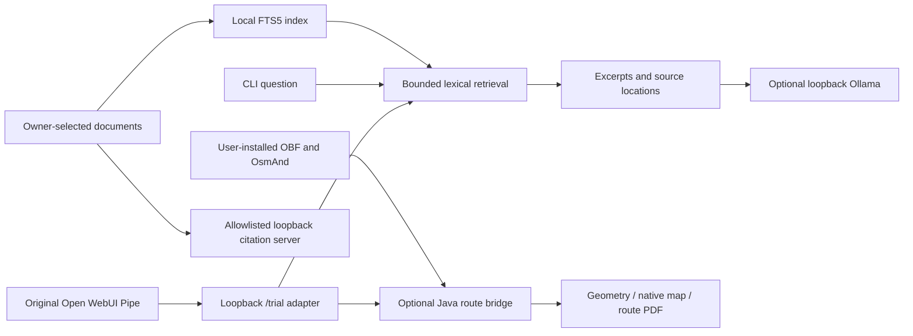

# Architecture and reuse

The source allowlist preserves actual modules from compact-offline-trial.
reference_helpers and model_query extract only the named functions from the
existing local-qa/ask.py. bot.py provides a configurable entry point and adapts its
existing FTS5 build schema. No workspace, git history, private memory or runtime
state is imported. Routing remains a separate optional module; the core does
not silently guess coordinates or invoke it on a broad text match.

## Existing solutions preflight

Reuse these established projects instead of rebuilding their engines:

- [Ollama](https://github.com/ollama/ollama): optional local inference.
- [llama.cpp](https://github.com/ggml-org/llama.cpp): alternative local inference;
  not integrated by this snapshot.
- [Kiwix](https://kiwix.org/en/applications/) and
  [kiwix-tools](https://github.com/kiwix/kiwix-tools): offline ZIM reading/search.
  The existing optional helper expects zimdump/zimsearch under local-qa/bin.
- [OsmAnd](https://osmand.net/) and
  [OsmAnd tools](https://github.com/osmandapp/OsmAnd-tools): existing map/routing
  engine, reused through Java rather than implementing navigation.
- [Open WebUI](https://github.com/open-webui/open-webui): optional chat frontend;
  separate installation, current licensing must be reviewed, no UI integration
  qualification in this repository.
- [Internet-in-a-Box](https://internet-in-a-box.org/): broader offline content
  appliance worth using when the goal is distribution, not bounded AI answers.
- [SQLite FTS5](https://www.sqlite.org/fts5.html), Poppler and ReportLab:
  existing indexing, extraction and print components.

These are upstream references, not a current comparative benchmark or paid-service
recommendation. This project adds small bounded retrieval/citation/routing glue.

## Offline boundary

Initial OS packages, Python wheels, tools, model weights, documents, map snapshots
and archives normally require network. Obtain them from official sources and keep
licenses/checksums alongside your private offline library. Runtime core tests need
no network. Optional AI uses numeric loopback only; document serving is loopback
only. A separately managed app may have its own update/network behavior: verify
that separately before depending on air-gapped operation. No cloud monitoring,
account integrations or automatic downloads are included.

## Differences from the original application

The original Function/Pipe is included, with a configurable numeric-loopback URL.
The minimal HTTP adapter preserves its /trial wire format, original text validation,
scoped verified-route printing and artifact reader/server. It delegates to existing
retrieval, local inference and named/multistate routing functions, not a new engine.
Only backend/Pipe integration is qualified, not authenticated Open WebUI use.
Private memory/recall, original history summarization, calculator dispatch,
illustrated Guide generation and legacy Map dispatch remain omitted. No complete
application parity is claimed. See [compatible API and setup](CHAT.md).

## Portable profiles and confined documents

`install.sh → launch.sh → portable.py → flash_install.py` reuses the verified
allowlist installer. Linux `lsblk` is discovery only; fresh-target validation and
exact path confirmation precede writes. `bootstrap.py --from-source` delegates to
that same source rather than silently installing an old release.

Both profiles retain the GPL source and the rights-aware manual catalog/downloader.
Bot retains retrieval, optional local inference and optional chat/routing modules;
database mode exports the same FTS5 source excerpts to `reference.html`, using only
inline static assets and deterministic browser search. No inference/server is
needed to read the export. Empty or truncated content is visibly identified.

`document_workspace.Workspace` is a separate restricted create/read/update/print
interface rooted by the owner at installed `workspace/`, outside the reference
library. The request cannot choose the root. The existing model has no tool loop;
a trusted caller/user submits reviewed edits. Printable HTML escapes all document
content. No new network or host-administration authority is introduced.
See [boundaries and workflow](FLASH_INSTALL.md).

`offline_diagnostics` is an opt-in Bot extension: pasted text → heuristic redaction
→ deterministic token/error extraction → separate in-memory FTS5 guide references
→ evidence/uncertainty/safe-check report. Raw logs never reach the main library or
a persistent index. Only reviewed code defines suggestions; untrusted guide text
is quoted evidence, never instructions. Optional reports use the confined workspace.

### Managed intake, confirmed scans and compact inference

Explicit `data/intake` + legacy safe guides → validated immutable generation → FTS5
+ HTML + hash/provenance → one atomic reference.html publication marker shared by
CLI and browser. Old generations remain valid; failed rebuilds do not replace them.

Linux diagnostic plan reads only fixed-allowlist metadata; explicit matching scope
confirmation enables bounded, timestamp-filtered read-only tails. Redaction precedes
analysis/reporting. No commands, elevation, configuration writes or network path.

All deterministic handlers remain outside inference. Optional model envelopes
whitelist only current question and a few small cited excerpts plus one short
instruction. Tiny/standard budgets reject overload and return a labeled source
fallback; tool catalogs/history/whole documents are not serialized.
